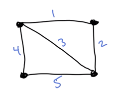

# Minimum Spanning Trees

We want to connect a bunch of points together as cheaply as possible. (build a network).

Applications include __clustering__ and __networking__
and run in O(mlogn). 

- M - edges
- N vertices

We are considering undirected graphs here.

G = (V,E)

We assume the graph is given as an adjacency list (link?)
Edges can be negative (otherwise we could have used Dijkstra's)

We are looking for a tree that spans all vertices, cannot have loops, and the tree is connected. 

- Input graph G is connected.
- Edge costs are distinct

*these assumptions are not important, just simplify things a bit.

##Prim’s mst algorithm

Let's take this graph - 

